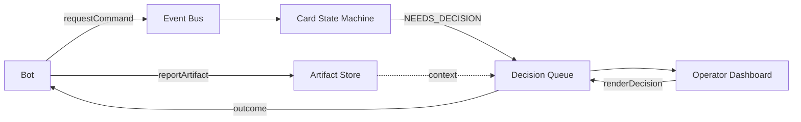

# ClawOps

**You are the slowest link in your AI agent system.** Bots block on human decisions across scattered threads and platforms, context gets lost, and work stalls silently. ClawOps is a Convex-native ops runtime that gives you a unified Decision Queue — a single, prioritized inbox where every bot-blocked-on-human decision surfaces with full context, artifacts, and one-click resolution.

## What It Does

- **Decision Queue** — Prioritized inbox (now / today / whenever) with claim leasing, compare-and-set rendering, and expiration with fallbacks.
- **Event Bus** — Append-only log linking commands, runs, decisions, and artifacts via correlation chains. Full traceability for "what happened, why, and what did it produce?"
- **Artifact Store** — Immutable, content-addressed (SHA256) outputs with per-project dedup and provenance linking.
- **Bot Adapter** — Four-function interface: `requestCommand`, `reportArtifact`, `requestDecision`, `awaitDecision`.

## Architecture



## Quick Start

**Prerequisites:** A [Convex](https://convex.dev/) account and Node.js.

```bash
# Clone and install
git clone <repo-url> && cd clawops/clawops
npm install

# Start Convex backend + React frontend
npm run dev
```

### Wire a bot

```typescript
import { clawops } from "./clawops";

// Request work
const { commandId } = await clawops.requestCommand({ ... });

// Produce output
const { artifactId } = await clawops.reportArtifact({ ... });

// Block on a human decision
const { decisionId } = await clawops.requestDecision({ ... });
const outcome = await clawops.awaitDecision(decisionId);
```

## Scripts

| Command | Description |
|---------|-------------|
| `npm run dev` | Start frontend + backend |
| `npm test` | Run all tests (147 passing) |
| `npm run build` | TypeScript check + production build |

## Current Status

v1 — functional core. Event bus, card state machine, decision queue, artifact store, RBAC, sweeper, and operator dashboard are implemented and tested. See `docs/design.md` for the full design.

## License

MIT
